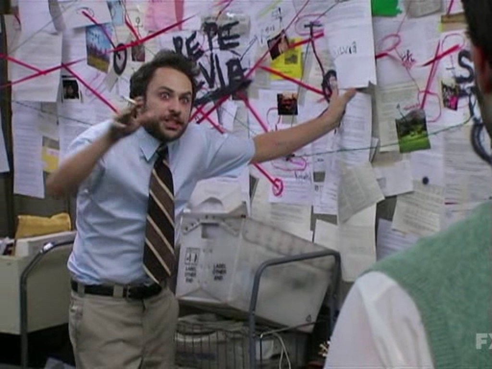

import QED from "@components/QED.astro";

{/* What do I need to achieve in this post?

- [x] Hook the audience
- [x] Explain what the problem is
- [x] Explain why I care about the problem
- [ ] Explain why the math is interesting / make some outside connections
- [x] Introduce the mathematical formulation of the problem
- [ ] Explain card dealing
- [ ] Talk about the card dealing optimizations and performance
- [ ] Talk about card dealing's bias
- [ ] Talk about progressive stars and bars
- [ ] Talk about psb's optimization and performance
- [ ] Talk about psb's bias */}


## Introduction

*"Who has what cards?"*

If you have ever played a card game (and I assume most of you have), then you have asked yourself a version of this question. You may know how many cards each player has, and you may even know how many of each card type is left, but who has which cards?

Barring straight-up cheating, there *usually* isn't an easy way to know that information.

{/* TODO: Attribution */}


But you can make some educated guesses about what they might have and--maybe even more usefully--you can know what they do *not* have.

As part of my ongoing upgrades to `monte-cardo` (my Information Set Monte Carlo Tree Search solver for ladder shedding games, read more about that [here](TODO)) I found myself needing to ask the same question.

{/* TODO: Update */}
For more details, motivated readers should check out the appropriate blog and project posts, but a quick explanation will suffice for our purposes:

The algorithm relies on generating many different "hypotheses" for what hands the other players might have. Each of these hypothetical game states is what we call a "possible world", and we evaluate each of our available moves over a bunch of these possible worlds so that we can get a better idea of how good that move is.

The problem that I am addressing in this blog post is the generation of those possible worlds. We want to do it quickly, and we want to generate a wide range of possible worlds (more on what that means in a bit).

But how do we create these possible worlds? For our purposes there is only one unknown factor in the game, and that is other players' hands. Luckily, a computer program is just about the best card counter out there, so we do know two things:

1. We know exactly how many cards each player currently has. Every player gets to see the cards dealt, and the cards played from the hand are public knowledge.
2. We know exactly how many of each rank of card are left. The deck that we are playing with is public knowledge, and--once again--the cards that players play are public knowledge.

### Formulation
Let's be a bit more precise about our definitions.

First, we can actually represent this problem in the form of a matrix. Consider the following scenario:

Player A has 3 cards remaining, player B has 4 cards remaining, and player C has 7 cards remaining. All of the deck's cards have been played, except the 4 Aces, 2 Kings, 3 Queens and 2 10s. We can represent the problem of choosing a possible world with the following matrix.

$$
\begin{array}{cccc|c}
? & ? & ? & ? & \text{A} = 3 \\[0.35em]
? & ? & ? & ? & \text{B} = 4 \\[0.35em]
? & ? & ? & ? & \text{C} = 7 \\[0.35em]
\hline
\text{Aces} = 4 & \text{Kings} = 2 & \text{Queens} = 3 & \text{10s} = 2
\end{array}
$$

With this framework, the set of all possible worlds is exactly the set of integer matrices with non-negative entries which have these specific row and column sums. When I asked ChatGPT what this problem should be called, it gave me fun--but technically correct--answers like, "integer points in a transportation polytope" or "fiber of a contingency table".

While I am going to leave these suggestions here for the entertainment of the reader--and maybe also the benefits of search engine optimization--I have elected to call this problem "sampling non-negative integer matrices with fixed-margins".

One thing to note is notion of "total mass". The sum of all entries in the matrix must equal the sum of the row margins, and the sum of the column margins. This is what I am calling the total mass of the problem, and it corresponds, in our case, to the number of cards remaining.

The second part of our formulation is defining what we mean by "wide range of possible worlds". For our possible world sampling to be useful, we have to ensure that we are considering many *different* possibilities. In practice, that means that we want to sample worlds that are likely to occur while playing the game.

Instead, I am going to use a simplification. I will define "wide range" as sampling from the uniform distribution on the set of all possible worlds, and we will evaluate sampling methods by their uniformity, or lack thereof.

## The Simple Solution
The natural starting point for solving this problem is simply dealing the cards, while respecting the constraints imposed by the margins. I'll call this algorithm the "card-dealing" approach.

While the most naive version of this approach is to create a list of cards, and then shuffle and deal them, creating and shuffling a list is quite slow and unnecessary. We waste time shuffling items that are for our purposes identical.

Instead, the process will be something like this: The number of cards we have to deal corresponds to the total mass. Each step of the algorithm, we simply select a row and a column which have remaining unallocated mass, and then add one to the entry at that row and column. Then, we update the remaining unallocated mass for the row and column, so that we can skip selecting columns and rows who are already "full".

{/* TODO: How much more do I need to explain here? Does it make sense? What is confusing? */}

### Implementation
Because `monte-cardo` is written in Rust, all of the implementations and performance testing of the sampling algorithms in this post and the rest of this series will be done in Rust.

The card-dealing algorithm looks a bit like this:
```rust link=https://github.com/HesitantlyHuman/monte-cardo/blob/339711cebefd779664921656f112ed0870ee323a/crates/monte-cardo-core/src/world/dealing.rs#L4-L50
pub fn card_dealing<const M: usize, const N: usize>(
    row_margins: [usize; M],
    column_margins: [usize; N],
    rng: &mut SmallRng,
) -> [[usize; N]; M] {
    let mass_total: usize = row_margins.iter().sum();
    debug_assert!(column_margins.iter().sum::<usize>() == mass_total);

    let mut output = [[0; N]; M];

    let mut remaining_row_mass = row_margins;
    let mut remaining_col_mass = column_margins;

    let mut active_rows = Vec::with_capacity(M);
    let mut active_cols = Vec::with_capacity(N);

    active_rows.extend((0..M).filter(|&row| remaining_row_mass[row] > 0));
    active_cols.extend((0..N).filter(|&col| remaining_col_mass[col] > 0));

    for _ in 0..mass_total {
        let num_cols = active_cols.len();
        let index = rng.random_range(0..active_rows.len() * num_cols);

        let row_idx = index / num_cols;
        let col_idx = index % num_cols;

        let row = active_rows[row_idx];
        let col = active_cols[col_idx];

        output[row][col] += 1;

        remaining_row_mass[row] -= 1;
        remaining_col_mass[col] -= 1;

        if remaining_row_mass[row] == 0 {
            active_rows.swap_remove(row_idx);
        }

        if remaining_col_mass[col] == 0 {
            active_cols.swap_remove(col_idx);
        }
    }

    debug_assert!(output.iter().flatten().sum::<usize>() == mass_total);

    return output;
}
```

When testing the algorithm, I also experimented with avoiding the integer division and modulo by generating two numbers, one for the row, and another for the column.

To absolutely no-one's surprise, generating another random number was slower than my first version of the algorithm. What was interesting, however, was how much slower.

Here is the output for one of the regression tests of the function, which I ran on the alternative implementation (The regression/performance testing for the Monte Cardo project was done with `criterion.rs`).


Across the board, regression tests showed the function to be over 50% slower than the single rng version. While it's nice we can optimize the function so much, the larger point is this:

Since changing 1 rng call to 2 rng calls increased the runtime by half of the previous runtime, that suggests that around half of the runtime for this algorithm is spent generating random numbers.

If we can find a way to generate less random numbers for each world we sample, we may be able to find a much faster algorithm.

### Is Card-dealing Uniform?
Before we look at how we can create improved methods, however, we need to address our other design constraint. Does this method sample uniformly from all possible worlds?

Unfortunately, it does not. While it does have non-zero probability for every possible world, some worlds are more likely to be sampled than others. The algorithm is biased towards states that "capture it". If the algorithm is unable to continue adding mass to a row or column, then the number of possible states that it can reach has narrowed. It is biased towards states that fill up the capacities of low mass rows and columns early.

In other words, this method spreads the mass out across the matrix entries more than you would expect from a uniform distribution.

<details>
<summary><b>Counterexample for the non-uniformity of the card-dealing algorithm.</b></summary>
To prove that the card-dealing algorithm does not result in sampling that is uniformly distributed, consider the following counterexample.

We begin with the row and column margin constraints of $[2, 1]$ and $[1, 2]$, respectively.

$$
\begin{array}{cc|c}
? & ? & r_0 = 2 \\[0.35em]
? & ? & r_1 = 1 \\[0.35em]
\hline
c_0 = 1 & c_1 = 2
\end{array}
$$

Since this is a $2\times2$ matrix, solutions to the fixed margin problem are uniquely determined by a $1\times1$ submatrix of the problem.

Notice that the top-left entry of the matrix must be either $0$ or $1$, because the corresponding column margin is $1$. Setting that entry and solving for the remaining matrix entries gives us two possible solutions to this fixed-margin problem.

$$
A =
\begin{bmatrix}
0 & 2 \\
1 & 0
\end{bmatrix}
\qquad
B =
\begin{bmatrix}
1 & 1 \\
0 & 1
\end{bmatrix}
$$

If the algorithm does in-fact sample uniformly from all possible worlds, then for this 2 solution problem, each matrix should be selected with probability $\frac{1}{2}$.

Let's calculate the probability that matrix $A$ is sampled.

In the initial state, all four cells are open for assignment. If either the top-left or bottom-right corners are chosen, then the resulting solution cannot be $A$, so we will omit those possibilities.

Choosing the bottom-left corner as our first mass assignment gives the matrix

$$
\begin{bmatrix}
0 & 0 \\
1 & 0
\end{bmatrix}
$$

which forces $A$.

The interesting case is when we choose the top-right corner and get this matrix instead:

$$
\begin{bmatrix}
0 & 1 \\
0 & 0
\end{bmatrix}
$$

From this position, both solution $A$ and solution $B$ are still possible. We consider the next mass assignment and see that choosing top-left will force $B$, choosing top-right will force $A$, bottom-left will also force $A$, and bottom-right will force $B$.

Since each of these choices still have probability $\frac{1}{4}$, solution $A$ and solution $B$ are chosen with equal likelihood, if the first mass assignment is placed in the top-right cell.

Putting all of this together, we can calculate the probability that the card-dealing algorithm will sample solution $A$.

$$
P(x = A) = \frac{1}{4}(1) + \frac{1}{4}(\frac{1}{2}) = \frac{3}{8}
$$

Since the probability of sampling world $A$ is less than $\frac{1}{2}$, we must conclude that this algorithm is a biased sampler.

<QED/>

---

*Maybe*--you might say--*we should simply sample each row and column according to its remaining unassigned mass?*

Great idea dear reader! Let's see if that improves or fixes the bias of our sampling method.

We will start with the same example problem as before. This time when sampling for the first mass placement, choosing the first row has probability $\frac{2}{3}$, and choosing the second row has probability $\frac{1}{3}$. The columns get a similar adjustment.

Choosing the top-right cell as the first assignment is again the only interesting case. Since it results in a remaining unassigned mass margin of $1$ for every row and column, the second assignment is once again selected uniformly. Once we have placed mass in the top-right, the probability for each possibility ($A$ and $B$) is $\frac{1}{2}$.

And so, with the alternative sampling method for our card-dealing algorithm, we get the following probability:

$$
P(x = A) = (\frac{2}{3} \frac{1}{3})(\frac{1}{2}) + (\frac{1}{3}\frac{1}{3})(1) = \frac{1}{3}
$$

Somehow this new way of sampling has made our bias even worse! (For this specific case).

Unfortunately, adjusting the likelihoods of the various columns and rows does not eliminate the bias inherent to this approach.
{/* TODO: I may need to say more about this. I suspect that the only way to set the probabilities of each column and row properly is to actually know the entire "tree" from your current position, which defeats the entire purpose of the card-dealing algo. I haven't put much thought yet into how to show this, however. */}
</details>

## Stars-and-Bars
Before we move on to the next algorithm, let's take a look at a simpler problem, and the solution to that problem.

The related problem is often formulated as balls in urns, or cookies to children, but the idea is the same. Distribute some fixed number of items into a fixed number of bins, uniformly.

This is exactly the 1-dimensional case of our possible worlds problem. And luckily for us, there is a great algorithm for doing this uniformly.

{/* TODO: finish explaining stars-and-bars */}

## Greedy Stars-and-Bars
So how do we use the stars-and-bars approach for our 2d problems?

While I did try in vain to figure out a way that I could replicate the simplicity of stars-and-bars, I wasn't able to. The ideal would be if we could just sample $N\times M$ total numbers, and then sort them in a way that would preserve all of our margins.

While not the only problem, one of the largest problems that an approach like this faces is that not every selection of $N\times M$ integers which are less than the total mass forms a valid solution to the possible world problem.

<details>
<summary>*Example of invalid set of integers*</summary>
Consider again the example that we used to prove nonuniformity for the card-dealing algorithm.

$$
\begin{array}{cc|c}
? & ? & r_0 = 2 \\[0.35em]
? & ? & r_1 = 1 \\[0.35em]
\hline
c_0 = 1 & c_1 = 2
\end{array}
$$

Since the total mass is $3$, we start by sampling $4$ integers which are less than or equal to $3$. Trivially, let's take $[0, 0, 0, 0]$.

No matter how we sort or arrange these values, this selection of bars implies that one of our cell entries will have a value of $3$. Unfortunately for us, no matter which cell we choose, that will violate not one, but *both* the row and column constraint.
</details>

Instead of trying to construct some impossible miracle solution, let's try something a bit simpler, and more reasonable.



The general approach of the "Greedy Stars-and-Bars" algorithm is to fill in our matrix one row or column at a time. If we do that, then we can just use normal Stars-and-Bars to sample the values for that row or column.

The only thing we need to ensure is that we do not violate the constraints of the rows or columns that we are "crossing" (that are perpendicular to the row or column that we are currently filling).

All we need to do is to select the row or column which has the smallest remaining unassigned mass. No matter what values come out of the Stars-and-Bars, they cannot exceed the perpendicular constraints, because the constraint that we are currently honoring is the smallest constraint "on the board", so to speak.

Let's do a quick example. Consider the following fixed-margin problem.

$$
\begin{array}{ccc|c}
? & ? & ? & r_0 = 3 \\[0.35em]
? & ? & ? & r_1 = 4 \\[0.35em]
? & ? & ? & r_2 = 7 \\[0.35em]
\hline
c_0 = 4 & c_1 = 5 & c_2 = 5
\end{array}
$$

The currently most-constrained row or column is $r_0$, with $3$ remaining unassigned mass. We will start by performing stars-and-bars across that row. The sampler gives us $[0, 1, 2]$ as the row.

$$
\begin{array}{ccc|c}
0 & 1 & 2 & r_0 = 0 \\[0.35em]
? & ? & ? & r_1 = 4 \\[0.35em]
? & ? & ? & r_2 = 7 \\[0.35em]
\hline
c_0 = 4 & c_1 = 4 & c_2 = 3
\end{array}
$$

Notice that we couldn't violate any constraints, because all the values sampled would be $\leq 3$. The next most constrained row or column is $c_2$. Here, we will sample only for the entries which are not already assigned, so we only need to distribute the $3$ remaining mass among two bins.

$$
\begin{array}{ccc|c}
0 & 1 & 2 & r_0 = 0 \\[0.35em]
? & ? & 2 & r_1 = 2 \\[0.35em]
? & ? & 1 & r_2 = 6 \\[0.35em]
\hline
c_0 = 4 & c_1 = 4 & c_2 = 0
\end{array}
$$

You simply continue that process until the entire matrix is filled. It will always generate a valid solution to the fixed-margin problem.

What is nice about this algorithm is that it does not depend on the total mass. The card-dealing algorithm, for example, is $\mathcal{O}(T)$, where $T$ is the total mass of the problem.

The greedy stars-and-bars algorithm is $\mathcal{O}(N + M)$, instead. It scales with the size of the matrix.

### Implementation
The implementation of this algorithm has two parts. The first part is a simple stars-and-bars sampler.

```rust link=https://github.com/HesitantlyHuman/monte-cardo/blob/79787a74ca8a3f23ed8f8ff3c0a69c23700e6baf/crates/monte-cardo-core/src/world/stars_and_bars.rs#L5-L38
fn stars_and_bars<const N: usize>(
    mass: usize,
    slots: usize,
    output: &mut [usize; N],
    rng: &mut SmallRng,
) {
    debug_assert!(slots <= N);
    debug_assert!(slots > 0);

    if slots == 1 {
        output[0] = mass;
    }

    let num_bars = slots - 1;
    let mut bar_positions = [0usize; N];

    for i in 0..num_bars {
        bar_positions[i] = rng.random_range(0..=mass);
    }

    bar_positions[..num_bars].sort_unstable();

    let mut previous_bar = 0;

    for idx in 0..num_bars {
        let bar = bar_positions[idx];
        output[idx] = bar - previous_bar;
        previous_bar = bar;
    }

    output[num_bars] = mass - previous_bar;

    debug_assert_eq!(output[..slots].iter().sum::<usize>(), mass);
}
```

This stars-and-bars implementation uses a mutable array slice to reduce allocation overhead, and avoid the use of unnecessary `Vec<>`s. `sort_unstable` simply means that the original ordering of the elements will not necessarily be maintained, which we don't care about here anyway, and the unstable sorting is much faster.

The real meat and potatoes of the algorithm is this function however:

```rust link=https://github.com/HesitantlyHuman/monte-cardo/blob/79787a74ca8a3f23ed8f8ff3c0a69c23700e6baf/crates/monte-cardo-core/src/world/stars_and_bars.rs#L40-L101
pub fn greedy_stars_and_bars<const M: usize, const N: usize>(
    row_margins: [usize; M],
    column_margins: [usize; N],
    rng: &mut SmallRng,
) -> [[usize; N]; M] {
    let mut output = [[0; N]; M];

    let mut remaining_row_mass = row_margins;
    let mut remaining_col_mass = column_margins;

    let mut active_rows = Vec::with_capacity(M);
    let mut active_cols = Vec::with_capacity(N);

    let mut row_allocations = [0; N];
    let mut col_allocations = [0; M];

    active_rows.extend((0..M).filter(|&row| row_margins[row] > 0));
    active_cols.extend((0..N).filter(|&col| column_margins[col] > 0));

    while !active_rows.is_empty() && !active_cols.is_empty() {
        // First, find our candidates
        let mut best_row_index = 0;
        let mut best_row_index_location = 0;
        let mut best_row_value = usize::MAX;
        for (row_location, row_index) in active_rows.iter().enumerate() {
            if remaining_row_mass[*row_index] < best_row_value {
                best_row_index = *row_index;
                best_row_value = remaining_row_mass[*row_index];
                best_row_index_location = row_location;
            }
        }

        let mut best_col_index = 0;
        let mut best_col_index_location = 0;
        let mut best_col_value = usize::MAX;
        for (col_location, col_index) in active_cols.iter().enumerate() {
            if remaining_col_mass[*col_index] < best_col_value {
                best_col_index = *col_index;
                best_col_value = remaining_col_mass[*col_index];
                best_col_index_location = col_location;
            }
        }

        if best_row_value < best_col_value {
            stars_and_bars(best_row_value, active_cols.len(), &mut row_allocations, rng);
            for (col, allocation) in active_cols.iter().zip(row_allocations) {
                output[best_row_index][*col] = allocation;
                remaining_col_mass[*col] -= allocation;
            }
            active_rows.swap_remove(best_row_index_location);
        } else {
            stars_and_bars(best_col_value, active_rows.len(), &mut col_allocations, rng);
            for (row, allocation) in active_rows.iter().zip(col_allocations) {
                output[*row][best_col_index] = allocation;
                remaining_row_mass[*row] -= allocation;
            }
            active_cols.swap_remove(best_col_index_location);
        }
    }

    return output;
}
```

The start of the function does a bit of bookkeeping work: Allocating some vectors, creating the array buffers for the stars-and-bars helpers, figuring out which rows need allocating.

Then, we find our candidate row or column, and call stars and bars. Fairly simple, all things considered.

### Performance
But how does it perform, compared to the card-dealing algorithm?

This algorithm will generate $N \times M$ random numbers, instead of one for each unit of mass, but it does suffer from more overhead, bookkeeping and branching than the other method.


> [!IMPORTANT]
> Get the metrics and graphs for this section, and put those bad boys in here!

### Is Greedy Stars-and-Bars Uniform?

No.

We find ourselves in the same boat as before. This method does not select uniformly from all possible worlds, even though it does sample every possible world with non-zero probability.

Interestingly, this method biases the selection of possible worlds in the opposite direction.

When we are using this method, possible worlds which have concentrated mass are more likely to be selected. Concentrated mass means that the world matrix has more singular high-value entries.

Practically, this means that a world where Bob has 4 Kings, and Alice has 4 Aces is more likely to be selected than a world where Bob and Alice both have 2 Kings and 2 Aces.

<details>
<summary><b>Demonstration of Greedy Stars-and-Bars bias</b></summary>
It is sufficient to show that more concentrated distributions of mass are overrepresented by this algorithm, since that will both prove nonuniformity, and show the mechanism by which the bias functions.

Consider the following $2\times3$ fixed-margin problem:

$$
\begin{array}{ccc|c}
? & ? & ? & r_0 = 3 \\[0.35em]
? & ? & ? & r_1 = 3 \\[0.35em]
\hline
c_0 = 2 & c_1 = 2 & c_2 = 2
\end{array}
$$

The greedy stars-and-bars algorithm will first choose a column to fill. Since each column is identical, we will choose $c_0$ without loss of generality.

There are three options for the stars-and-bars allocation of this column, namely $[0, 2]$, $[1, 1]$ and $[2, 0]$. We will be choosing from each of these with $P = \frac{1}{3}$.

For this demonstration, we will consider the concentrated allocation $[2, 0]$ and the "spread-out" allocation $[1, 1]$, and show that there are fewer final states which have the concentrated allocation, so those states will be overrepresented by the uniform selection of $c_0$.

*Concentrated Mass Assignment*

If we suppose that we assign $[2, 0]$ to $c_0$, then we have the remaining problem:

$$
\begin{array}{ccc|c}
2 & ? & ? & r_0 = 1 \\[0.35em]
0 & ? & ? & r_1 = 3 \\[0.35em]
\hline
c_0 = 0 & c_1 = 2 & c_2 = 2
\end{array}
$$

Since the remaining unassigned mass in $r_0$ is just $1$, then we can easily see that there are only $2$ possible states after the concentrated assignment. Either the $1$ goes in $c_1$, or it goes in $c_2$.

*Spread-out Mass Assignment*

Now the remaining problem after the spread-out assignment of $[1, 1]$ to $c_0$:

$$
\begin{array}{ccc|c}
1 & ? & ? & r_0 = 2 \\[0.35em]
1 & ? & ? & r_1 = 2 \\[0.35em]
\hline
c_0 = 0 & c_1 = 2 & c_2 = 2
\end{array}
$$

Here, the remaining open columns in $r_0$ can have the values $[2, 0]$, $[1, 1]$ or $[0, 2]$, each of which correspond to a single valid solution to the problem. Therefore, there are $3$ possible states after the spread-out mass assignment, rather than $2$ like we see in the concentrated assignment.

The sampler is not uniform, and the sampler is biased towards concentrated states, because it is more likely to pick them than they "deserve".
</details>

> [!NOTE]
> The bias that this sampling algorithm has may actually work in my favor. We assume that as players play the game, they will naturally tend to eliminate entire classes of cards from their hands. This is because players tend to hold onto cards until they can play them all at once.
>
> So as the trick progresses, the game will bias towards concentrated solutions.
>
> However, at the start of the trick, this isn't a good representation of the possible worlds.

## Next Steps
Our whole goal was to create a uniform sampler over all possible worlds, and neither of these algorithms is even that!


Seems like if we want an unbiased sampler, I am going have to get \~_**creative**_\~...

In the next post in this series, I will explore some more ideas about how we can build a truly uniform sampler, and explain why it's a harder problem than you think (The scaling laws of combinatorics always seem to be getting in our way).