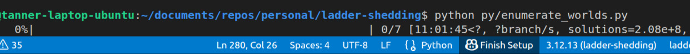
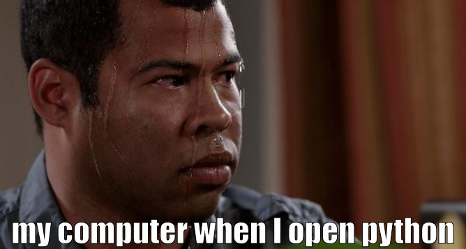

This article is part of a series! If you haven't read the first article in this series, consider heading [over there](/blog/fixed-margins-01) right now and coming back when you are done.

## So what now?
In the previous article, we discussed two methods for sampling solutions to fixed-margin problems: Card-dealing and Greedy Stars-and-Bars.

While both of these methods are quite fast, and will always generate a valid solution, neither of them sample from all possible worlds uniformly.

In this post, we will explore some more... _"**out there**"_ ideas in our search for a uniform sampling method. Mainly, we will explore which sampling these solutions uniformly is a lot harder than you would think.

## Index Sampling: Insert funny subtitle here
Maybe we don't need to do so much work sampling lots of different random numbers, and finding constraints or messing about with stars or bars.

*All* we want is to pick one possible world from the set of all of the possible worlds, with equal likelihood. Maybe all we need to do, is pick one.

For an approach like this to work, we would need two things:
1. First, we would need to know how many solutions there are to the specific fixed-margin problem in question.
2. Second, we would need a way of converting our selection (a sampled index) in to a possible world. That is, we need a bijective function that maps indices directly to solutions. Every index must be a solution, and every solution must have an index.

I wasn't certain that either of those things would be very easy. Combinatorics is one of those things that is never as simple as you might think.


But because creating that magic bijective function looked even more difficult, I decided that I wanted to start somewhere else.

### So, how many solutions are there?
Before trying to figure out our million dollar function, I decided that we should play around with some simple test cases, and figure out how many solutions these fixed-margin problem things tend to have.

For that, I needed a way to systematically generate all possible worlds for a given set of margins. I spent some time with pen and paper counting out possible worlds and discovered something interesting:

Sometimes, but not always, every solution to a given row or column would be able to result in valid fixed-margin solutions. In particular, this was the case if-and-only-if the row or column in question had the most restrictive constraint in the problem.

> [!NOTE]
> Eagle-eyed readers among you may recognize this approach. In writing up these articles I may have chosen to "break" the timeline a bit. This discovery is what led me to develop what eventually became the Greed Stars-and-Bars algorithm.

Using this realization, I quickly wrote up some python code that could enumerate all solutions to a given set of margins.

```python link=https://github.com/HesitantlyHuman/monte-cardo/blob/79787a74ca8a3f23ed8f8ff3c0a69c23700e6baf/scripts/enumerate_worlds.py#L75-L198 lines=178-180,89-90,107-108,115-116,119-119,127-127,129-129,131-132,137-137,141-141,149-149,155-155,157-157,159-160,165-165,169-169
def enumerate_states(
    row_constraints: list[int], col_constraints: list[int]
) -> Iterator[np.ndarray]:
    remaining_row_mass = row_constraints - np.sum(state, axis=1)
    remaining_col_mass = column_constraints - np.sum(state, axis=0)
    row_candidate_idx = int(np.argmin(masked_row_constraints))
    row_candidate_value = int(remaining_row_mass[row_candidate_idx])
    col_candidate_idx = int(np.argmin(masked_col_constraints))
    col_candidate_value = int(remaining_col_mass[col_candidate_idx])
    if row_candidate_value < col_candidate_value:
        open_col_idxs = np.flatnonzero(~cols_complete)
        allocations = stars_and_bars(row_candidate_value, len(open_col_idxs))
        for allocation in allocations:
            next_state = state.copy()
            next_state[row_idx, open_cols] = allocation
            yield from enumerate_from_state(next_state, ...)
    else:
        open_rows = np.flatnonzero(~rows_complete)
        allocations = stars_and_bars(col_candidate_value, len(open_row_idxs))
        for allocation in allocations:
            next_state = state.copy()
            next_state[open_rows, col_idx] = allocation
            yield from enumerate_from_state(next_state, ...)
```

With the code in hand, it was actually fairly simple to enumerate all of the possible solutions for some small fixed-margin problems.

| Size          | Row Margins       | Column Margins    | Total Solutions |
|---------------|-------------------|-------------------|-----------------|
| $(2\times 2)$ | $(10, 18)$        | $(12, 16)$        | $11$            |
| $(3\times 3)$ | $(3, 7, 2)$       | $(2, 5, 5)$       | $45$            |
| $(4\times 4)$ | $(3, 6, 2, 3)$    | $(2, 5, 5, 2)$    | $1446$          |
| $(5\times 5)$ | $(3, 4, 1, 3, 5)$ | $(2, 5, 5, 2, 2)$ | $49420$         |

*If you are paying attention to that left-most column, you might be feeling a sense of foreboding.*

The next thing that I tried was enumerating all of the possible states for something more... realistic to my use case.

I created a test scenario of a group of 7 players playing scum (a full standard deck of cards). To make the scenario a bit easier, I also pretended that some plays had already been made.

```python
# Up to 7 players, with 18 ordinality slots
player_constraints = [5, 4, 7, 6, 5, 3, 4, 0, 0, 0, 0, 0, 0, 0, 0]
card_counts = [2, 4, 2, 2, 4, 2, 4, 1, 1, 3, 4, 2, 3, 0, 0, 0, 0, 0]

# Plays (cards that are removed)
# 2 12s
# 2 10s
# 2 7s
# 2 4s
# 1 11s
# 1 8s
# 1 7s
# 2 2s
```

While I would love to tell you the results for that particular experiment, I would love even more to know the results for that experiment. Here is what I woke up to after a night of leaving my poor laptop churning:



That script ran for 11 hours, and it didn't even finish counting all of the states reachable by the first option of the first row (actually the 13th, because there are a lot of over-constrained entries in this matrix). Safe to say that the number of possible solutions to these problems gets **big fast**.



So we have a bit of a problem. See for the index sampling method to work, we need to be able to at least know how many possible worlds there are.

The other problem is that I would still need a good method for converting those indices (which we don't know how to get yet) into possible worlds. See the main problem is this: every branch--a partial solution to a particular problem--can have a different number of final solutions. We can't take any shortcuts in our counting, and it makes it difficult for us to map an index without re-counting through all of the possible worlds (which is not fast enough for our purposes, if you couldn't tell).

### Dynamic Programming
Some of you Computer Science types might be screaming at your screens by now that this sounds like a problem for *\~dynamic programming\~*.

Dynamic programming would resolve our combinatorial woes somewhat because it allows us to only count a branch if we haven't seen it before. That way we can skip lots of branches if we arrive at the same partial solution from different directions.

Unfortunately, dynamic programming trades memory for compute time. Just for kicks, I had ChatGPT generate a quick dynamic programming approach based on the existing enumeration code that I had, and gave it a run.

It crashed.

Immediately.

The second I pressed enter, my laptop ran out of memory and froze. Not that we didn't expect a result like that, but it is unfortunate that we will have to look elsewhere if we want to get an algorithm that will sample possible worlds uniformly.

## Noise Scaling
So what's next in our quest for the uniform sampling algorithm?

The next wild idea is that maybe we don't have to sample a valid solution, if we can just map our sample into the valid solution space. How would that work?

First, we will sample a non-negative matrix such that each entry is a uniformly selected real value in the range $[0, 1)$. Then, we will scale the rows and the columns so that they sum to the target margins.

The naive approach to this

---

{/* ### Noise Scaling */}
{/* TODO: explain the idea */}

{/* 
The first thing I did was pull things into python and just repeatedly scale the matrix and round.

def scale_noise_naive(
    row_constraints: list[int], col_constraints: list[int]
) -> np.ndarray:
    state = np.random.random((len(row_constraints), len(col_constraints)))
    row_constraints, col_constraints = np.array(row_constraints), np.array(
        col_constraints
    )
    if not np.sum(row_constraints) == np.sum(col_constraints):
        raise ValueError("Constraints do not equal same mass!")

    MAX_ITERATIONS = 1000
    for _ in range(MAX_ITERATIONS):
        row_sums = np.sum(state, axis=1)
        if np.any((row_sums == 0) & (row_constraints != 0)):
            raise RuntimeError("Unbound scaling detected!")
        row_factors = row_constraints / row_sums
        state = state * row_factors.reshape(-1, 1)

        col_sums = np.sum(state, axis=0)
        if np.any((col_sums == 0) & (col_constraints != 0)):
            raise RuntimeError("Unbound scaling detected!")
        col_factors = col_constraints / col_sums
        state = state * col_factors

        state = np.round(state)

        row_sums, col_sums = np.sum(state, axis=1), np.sum(state, axis=0)
        if np.all(row_sums == row_constraints) and np.all(col_sums == col_constraints):
            return state

    raise RuntimeError(f"Failed to converge after {MAX_ITERATIONS}!")

Even if I let it run for a thousand iterations, this would sometimes fail to converge. Either it could oscillate between 2 unsolved states, or it would set some row or column to 0. To quickly evaluate how good/bad this approach was, I ran a quick test with the following setups:

--- SIMPLE ---
row_constraints = [3, 4, 7]
col_constraints = [4, 5, 5]

--- BIGGER ---
row_constraints = [3, 4, 7, 2, 4]
col_constraints = [4, 5, 6, 3, 2]

--- LARGEST ---
row_constraints = [3, 4, 7, 2, 5]
col_constraints = [4, 3, 4, 3, 2, 3, 2]

And--drumroll please... here are the results. This method was much worse than I thought. (1000 trials for each)

SHOW THE RESULTS

But, how many iterations do we really need for a sucessful run? Maybe we can just generate more matrices and try again?

To test this out I averaged over 1000 trials of each of our previous examples, the number of iterations for a successful result.

SHOW THE RESULTS

It looks like even with the larger examples, the maxmimum number of iterations that it takes to get a successful results is 3.

I tested doing the rounding step only occasionally:
```
if iteration_count % 5 == 0:
    state = np.round(state)
```

SHOW RESULTS

Looks like that change does help but not enough. The larger test still has a failure ratio of almost 0.8. (Talk about how bad that would be with the rerolling approach)
*/}

{/* ### Submatrix Sampling */}
{/* 
While working on this, I had a thought...
# The full fixed-margin matrix is uniquely determined by the (N-1)x(M-1) submatrix.
# Maybe there is a way to sample a random integer matrix such that the entries are less than certain values. Is that easier than the full problem.

# Doesn't always generate a valid matrix
# For example:
# | ? | ? || 1
# | 1 | ? || 4
# |---|---||---
#   3   2
#
# We can see that the sub-matrix [[1]] cannot generate a valid solution. That implies that the bottom right entry is 3, which exceeds what is allowed for that column
#
# A valid solution:
# | 1 | 0 || 1
# | 2 | 2 || 4
# |---|---||---
#   3   2

I implemented the approach, so that I could see how often we ended up with invalid solutions. (In this case that means negative entries)

SHOW RESULTS

Unfortunately, the failure rate was quite high, and often depends one the exact nature of the margins, which is even more suboptimal.
*/}

{/* ### Honorable Mention: DP Based True Uniform Sampling */}
{/* TODO: explain */}

{/* While this method is reasonably fast for small examples, it has the same flaws as the index method. You end up needing to count all of final states

Running
player_constraints = [5, 4, 7, 6, 5, 3, 4, 0, 0, 0, 0, 0, 0, 0, 0]
card_counts = [2, 4, 2, 2, 4, 2, 4, 1, 1, 3, 4, 2, 3, 0, 0, 0, 0, 0]

Instantly crashed my laptop, because the cache filled all of my RAM in milliseconds.
*/}