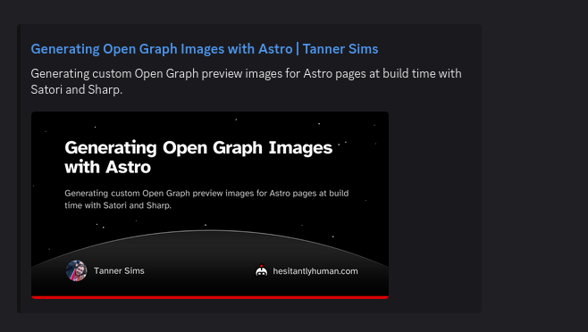
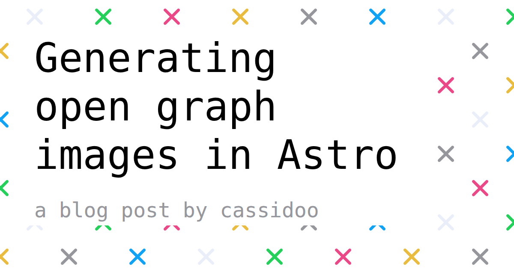
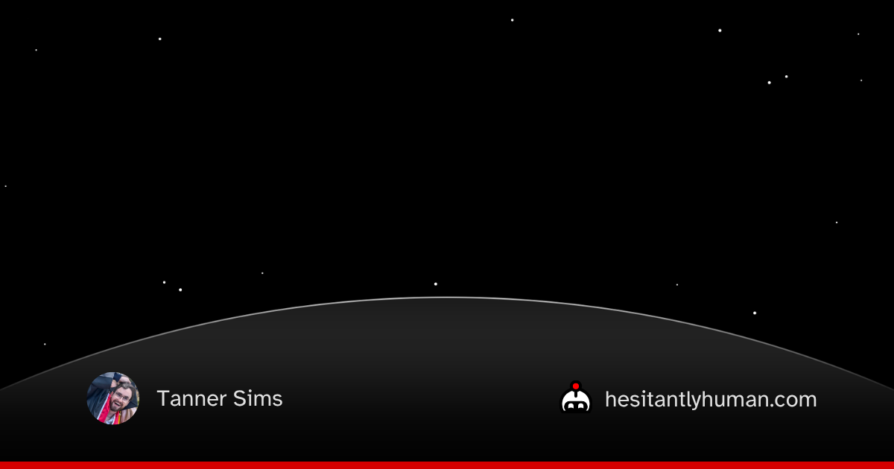

## Introduction
You've probably seen an Open Graph image before, even if you didn't know what it was called. It's the preview image that appears when you share a link on Discord, Slack, Facebook, WhatsApp, or wherever else your links may find themselves wandering.

You thought that was just web magic? (I'll admit that I did)

Sadly, no. Any website that wants the VIP treatment (a nice preview card) needs to tell platforms exactly how each page should be presented using [The Open Graph Protocol](https://ogp.me/). Open Graph lets a page define its title, description, preview image and all sorts of other useful properties.

For example, here is how it looks when you share this blog post on Discord (meta, I know):



As part of finalizing this site, I needed to update the Open Graph image included in each page's metadata. Astro Sphere--the template this site is based on, and a project that I contribute to--already has an Open Graph image, but I wanted something specific to the brand and identity of *my* site.

*(For more about the site itself, see [this project post](https://hesitantlyhuman.com/projects/personal_website/).)*

## What Open Graph Needs
What do we need to do to get Open Graph working?

Implementers of the protocol get the information they need by reading `meta` tags on the linked page. Using these tags, you can set the title, description, type, image and URL of your preview object.

That looks something like this:

```html
<meta property="og:title" content="My Page Title" />
<meta property="og:description" content="A description of the page." />
```

For some of my blog and project pages, I also needed to set additional, article-specific metadata: the author, publish date, modified date, general category, and optional tags.

## The Problem
As you can see, we have quite the list of metadata properties to set. Luckily, most of them either don't change, like the author of my blog posts, or are easy to access, like the page's title and description.

Unfortunately, the most important part of making a strong impression is also the hardest part: the image.

It would have been simple to just use the same generic image for every page, but I wanted something with a bit more style than that. I wanted each image that was shared to be specific to the page being linked.

That's important because sometimes the image is all that you get to see. X, for example, shows almost nothing except the image.

For my previews to be understandable, I needed the important information--like title and description--to be visible directly in the image.

## What I Wanted
So my target was pretty clear: I needed a custom Open Graph image for each page.

The first question I needed to ask myself was this: Was I willing to hand-make a customized Open Graph image for every new blog and project post on the site?..

_**HELL. NO.**_

So I needed to figure out a way that I could generate each of the images, and then automatically point each page's metadata at the correct generated image.

Broadly, the system I wanted needed to do three things:
1. Read the metadata for each page that needed an Open Graph image.
2. Generate an Open Graph image for each of those pages, and place that image where Astro could serve it (i.e. the `/public` folder).
3. Point each page's Open Graph tags to the correct image.

Beyond just achieving those goals, I wanted the process to be automatic. I didn't want a new manual step in my build or deployment process. Ideally, I could forget that this generator even existed, and it would keep on producing high-quality Open Graph images for every new project and blog post.

Finally, I wanted my site to stay fast. I was willing to let it do a little extra work at build time, but I didn't want image generation anywhere near my page load times. I wanted the final site to only need to serve static `.png` files.

The real kicker was going to be step two. The most complicated part isn't reading some metadata that was designed to be read, or pointing a URL in the right location; the hardest part would be generating an image that looks good, fits the site, and represents each page clearly.

## Option 1: Screenshots with Puppeteer
So how do we get this done? Since I am not a web-dev, I figured that it would be prudent to look around a bit first, and see how other people have tackled this problem.

I found [this post](https://cassidoo.co/post/og-image-gen-astro/) by Cassidy Williams, which linked to [this post](https://www.emgoto.com/astro-social-card/) by Emma Goto. They both used the JavaScript library [Puppeteer](https://pptr.dev/) to generate their Open Graph images.

The basic idea works like this:
1. Create a new page for your Open Graph design, where you can style, lay out and configure to your heart's content.
2. At build time, pass in the appropriate extra information to render that page. That would be things like an article title, description, author, etc.
3. Use Puppeteer to control Chrome and take a screenshot of your rendered design.
4. Profit.

Here's an example of the Open Graph image for Cassidy's blog post, generated using the Puppeteer method:



While this method would work great, and clearly gets the job done--Cassidy's Open Graph image here looks great, and really sells the vibe of her site!--it does have one major drawback. As noted by Cassidy in her post, Running Puppeteer to generate those screenshots can be slow.

To generate those images, Puppeteer is doing something much heavier than just "make this text an image". Puppeteer starts and controls a real browser to render the HTML template page. While the browser Puppeteer is using for this is headless--meaning that it doesn't need to run the UI or render anything to the screen--the machinery is all still there. With this method, Chrome has to start up, load the Open Graph template page, run any relevant JavaScript, apply CSS styling, lay out the page, paint the result, and then take a screenshot.

Reusing the same browser instance across multiple Open Graph images helps, but every image still requires loading the page, waiting for it to render, and then waiting to capture a screenshot. Depending on how many pages you need to support, that can get a little long, and I felt like I needed a bit more quality DX (Developer Experience) in my life.

## Option 2: Satori and Sharp
Determined to find a simpler approach, I kept searching. As I continued poking around, I found [this blog post](https://arne.me/blog/static-og-images-in-astro) by Arne Bahlo. Instead rendering a page with Chrome and taking a screenshot, Arne uses an HTML and CSS to SVG rendering library called [Satori](https://github.com/vercel/satori).

Once we can get our Open Graph image as an SVG, all that is left is to render it as a `.png` file. For that, I'll be using `sharp`. Arne used `sharp` as well, and I figure don't fix what ain't broke, right?

This approach is perfect, because most of my image is static. Since I am the only author on my site, and the URL and logo don't change, I can get away with baking all of those elements directly into the template. That way, the only things that we need to worry about rendering with Satori are the title and description.

To start, I whipped up a quick template Open Graph image, based on the styling of my website. It looked a little something like this--well, this is actually the final template, but you get the idea:




> [!NOTE]
> Satori can have difficulty with rendering certain fonts and it only supports a subset of CSS features. If you do plan on using Satori yourself, make sure that you have your branding fonts in a `.woff`, `.ttf`, or `.otf` format, and that you can do the necessary styling with Satori's CSS subset. `.woff2` is not currently supported as of the writing of this article.

Instead of doing anything fancy like creating an Astro endpoint (like you can see in Arne's post), I created a standalone `.tsx` script that loads all of my articles and generates images for them.

The structure of that script is fairly simple:

1. Load the static assets: the background template and fonts.
2. Read the metadata for every page that needs an Open Graph image.
3. Render each title and summary on top of the template with Satori.
4. Convert the generated SVG to a PNG with `sharp`.
5. Write the final image into `public/og`, where Astro can serve it like any other static asset.

Because this script runs before the site is built, none of the image-generation dependencies are shipped to the client. The browser only ever sees the final `.png` files. Wonderful. The website gets to look fancy, and I can continue to feed my fantasies of static compilation.

## Building the Image Generator
Now that we have a plan, let's get down to business to defeat the Huns.


...I mean, let's make the Open Graph image generator.

### Step 0: Define the Pages
For my site, there are two kinds of pages that need Open Graph images: static pages, like the homepage and project index, and content pages, like individual blog and project posts.

The static pages can be listed directly. Since I already have their metadata defined elsewhere in my site constants, the script imports those constants instead of duplicating.

To keep static pages and content pages using the same generation code, I defined a small shared type. Remember that most of the Open Graph layout does not change from page to page, so each generated image only needs three things: where it should be written, what title to render, and what summary to render.

```ts
type OgPage = {
    outputPath: string;
    title: string;
    summary: string;
};

const staticPages: OgPage[] = [
    {
        outputPath: "public/og/index.png",
        title: SITE.TITLE,
        summary: SITE.DESCRIPTION,
    },
    {
        outputPath: "public/og/blog.png",
        title: BLOG.TITLE,
        summary: BLOG.DESCRIPTION,
    },
    {
        outputPath: "public/og/projects.png",
        title: PROJECTS.TITLE,
        summary: PROJECTS.DESCRIPTION,
    },
];
```

### Step 1: Load the Assets
Next, the script loads the assets that Satori needs. The background template is stored in `src/assets`, not `public`, because I only want to serve the final generated images, not the raw template.

```ts
async function readAsset(relativePath: string): Promise<Buffer> {
    return fs.readFile(path.join(root, relativePath));
}

function toDataUrl(buffer: Buffer, mimeType: string): string {
    return `data:${mimeType};base64,${buffer.toString("base64")}`;
}

const regularFont = await readAsset("public/fonts/atkinson-regular.woff");
const boldFont = await readAsset("public/fonts/atkinson-bold.woff");

const background = await readAsset("src/assets/og/open-graph-template.png");
const backgroundSrc = toDataUrl(background, "image/png");
```

Satori can render images, but it needs access to them while generating the SVG. Encoding the background as a data URL keeps the script self-contained.

### Step 2: Read Post Metadata
For blog and project posts, I read the frontmatter directly from the `.md` and `.mdx` files. Astro already has this information during the normal build, but since this script is intentionally standalone, we need to collect the metadata ourselves.

```ts
async function readCollection(collection: CollectionName): Promise<ContentEntry[]> {
    const collectionDir = path.join(root, "src", "content", collection);
    const entries: ContentEntry[] = [];

    for await (const filePath of walkFiles(collectionDir)) {
        if (!filePath.endsWith(".md") && !filePath.endsWith(".mdx")) {
            continue;
        }

        const raw = await fs.readFile(filePath, "utf8");
        const { data } = matter(raw);

        if (data.draft) {
            continue;
        }

        entries.push({
            collection,
            slug: getContentSlug(collectionDir, filePath),
            title: data.title,
            summary: data.summary,
        });
    }

    return entries;
}
```

It is important that the generated image slug matches the eventual page slug. If the post lives at `/blog/my-post`, then the image should live somewhere predictable, like `/og/blog/my-post.png`. Later, the page metadata can point directly at that generated image URL.

### Step 3: Render SVGs
The actual Satori call looks a lot like writing a small React component. In my case, the component has one full-size background image and one absolutely positioned text block, containing both the title and description of the page.

```tsx
const svg = await satori(
    <div
        style={{
            width: WIDTH,
            height: HEIGHT,
            display: "flex",
            position: "relative",
            fontFamily: "Atkinson Hyperlegible",
        }}
    >
        

        <div
            style={{
                position: "absolute",
                left: 112,
                top: 92,
                width: 980,
                display: "flex",
                flexDirection: "column",
            }}
        >
            <div style={{ color: "white", fontSize: 62, fontWeight: 700 }}>
                {safeTitle}
            </div>

            <div
                style={{
                    marginTop: 34,
                    color: "rgba(255, 255, 255, 0.78)",
                    fontSize: 30,
                    lineHeight: 1.35,
                }}
            >
                {safeSummary}
            </div>
        </div>
    </div>,
    {
        width: WIDTH,
        height: HEIGHT,
        fonts: [
            {
                name: "Atkinson Hyperlegible",
                data: regularFont,
                weight: 400,
                style: "normal",
            },
            {
                name: "Atkinson Hyperlegible",
                data: boldFont,
                weight: 700,
                style: "normal",
            },
        ],
    },
);
```

This is where the “baked template” approach pays off. The logo, avatar, horizon, stars, and footer are already in the background image. Satori only needs to handle text layout, which is exactly the kind of task I want to give it. I was not exactly jumping at the chance to work with Satori's limited CSS subset, no matter how mature the library is.

We are not asking Satori to recreate an entire website here. We are asking it to put words in a box; truly a noble calling.

### Step 4: Convert to PNGs
Satori gives us an SVG string, but Open Graph consumers expect a URL to a "normal" image file, like a `.png` or `.jpg`. To get our final image, after rendering the SVG, I pass it through `sharp` and convert it to a `.png`.

```ts
return sharp(Buffer.from(svg)).png().toBuffer();
```

### Step 5: Write the Results
Finally, the script combines the static pages with the generated content pages, clears the old output directory, and writes a fresh set of images.

```ts
const contentEntries = [
    ...(await readCollection("blog")),
    ...(await readCollection("projects")),
];

const contentPages: OgPage[] = contentEntries.map((entry) => ({
    outputPath: `public/og/${entry.collection}/${entry.slug}.png`,
    title: entry.title,
    summary: entry.summary,
}));

const pages = [...staticPages, ...contentPages];

await fs.rm(path.join(root, "public", "og"), {
    recursive: true,
    force: true,
});

for (const page of pages) {
    await writeOgImage({
        page,
        backgroundSrc,
        regularFont,
        boldFont,
    });
}
```

At the end of this process, every page has a stable image path. Static pages get paths like `/og/blog.png`, while posts get paths like `/og/blog/generating-open-graph-images-with-astro.png`. The metadata layer can then reference those paths without knowing anything about Satori, Sharp, fonts, templates, or the terrible bargain I made with TypeScript to get JSX running in my build step.

## Serving the Images
Generating the images is only half the job. The other half is making sure every page points to the correct image in its metadata. Luckily, this is the easy part. Your mileage may vary, depending on how your Astro project is configured, but for this site, all I needed to do was pass some props to the `PageLayout` component.

For static pages, I can use explicit image paths:
```astro
<PageLayout
  title={PROJECTS.TITLE}
  description={PROJECTS.DESCRIPTION}
  image={getURL("/og/projects.png")}
>
```

And for article pages, the image path is derived from the collection and slug:
```astro
<PageLayout
  filePath={project.filePath}
  title={title}
  description={summary}
  image={getURL(`/og/${project.collection}/${project.slug}.png`)}
  type="article"
  publishedTime={project.data.date}
  modifiedTime={project.data.updated}
  section={project.data.category}
  tags={project.data.tags}
>
```

The layout then passes that information to the component responsible for the actual metadata tags (`BaseHead.astro`, in my case), and we are officially in business:
```astro
<meta property="og:image" content={imageURL} />
<meta property="og:image:alt" content={`${title}: ${description}`} />
```

## Conclusion
The resulting solution works flawlessly for my site. I especially love that it is a set-it-and-forget-it setup; I don't ever need to worry about tinkering with it unless I want to change how the images look.

Now, every time I push to `main`, the build will trigger, and the images are generated automatically. 

The final site still serves plain static files. The image-generation code stays in the build step, the browser only sees `.png`s, and my links look a little less boring when they wander into Discord.

Not too shabby for a day's work.

---

Well, that's all folks! I hope you enjoyed the show, and maybe even found this helpful. If you did, consider taking a look at some of my other posts, you might just enjoy one of them.

*Well would you look at that! There are buttons below which link to other articles?*