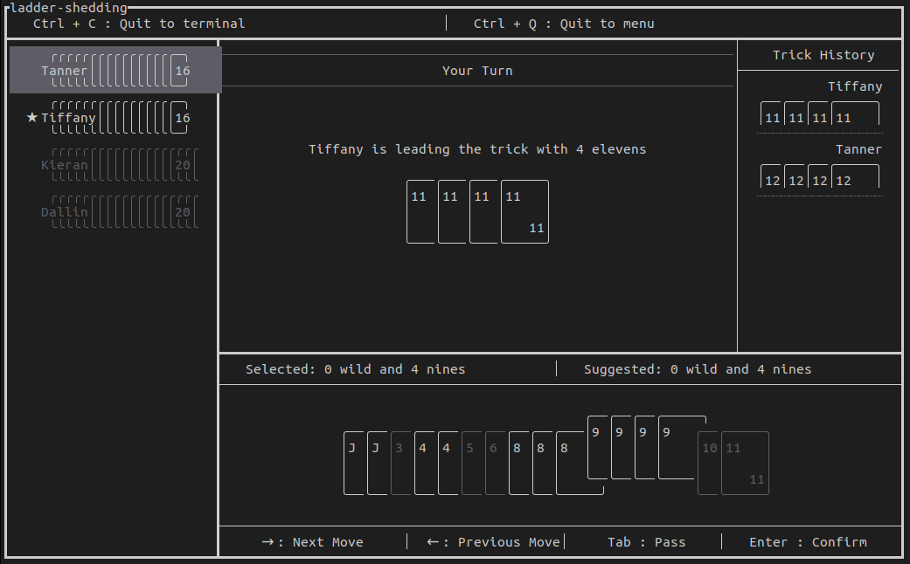

{/* TODO: Add the link to the project post */}
*(This blog post has an accompanying project post, which you can find here)*

## Background

A couple of years ago, I was playing [The Great Dalmuti](https://boardgamegeek.com/boardgame/929/the-great-dalmuti), when a hauntingly familiar thought began to creep into my head: *You could solve this.* *It's not that complicated.* *Just write a python program.*

I wanted to know what a really strong player looked like. I was doing very well, but was I playing optimally? Are these games deep and intricate, like chess, or do they eventually end up just being games of chance?

Somehow, I managed to convince myself that the state space of the game wasn't really _**that**_ big, and that the branching factor wasn't really _**too**_ bad. In my hubris, I missed what is the single biggest problem for anyone who wants to model these games:

Ladder shedding games--like The Great Dalmuti, or Scum--are imperfect information games. As a player in the game, you do not have the luxury of knowing the true state of the game.

Not only is the branching factor for these games much larger than I gave it credit for, but if you truly wanted to "solve" the game tree, you would need to take each of the actions you are already considering, and now consider them for every possible full state of the game, given the information you currently have (The full state of the game is also sometimes called the *"world"*, so I will be calling it that from now on).

Now that is a tall task! Figuring out how to deal with this "problem" of possible worlds became the crux of getting a working algorithm.

### A long story short

To get around these issues, I implemented a [Monte Carlo Tree Search](https://en.wikipedia.org/wiki/Monte_Carlo_tree_search) (MCTS). While this post isn't about explaining the basics of MCTS, there are a couple of features of this approach that are relevant to our problem:

1. The branching factor is irrelevant. Because MCTS uses *rollouts*, we can search deeply without exponentially increasing runtime.
2. MCTS does not require 
{/* TODO: Continue this list of why we like MCTS */}

### The state of it all

The resulting algorithm does work, and it even plays reasonable moves! (*hip-hip-horray!*) Here you can see me play against some AIs running the algorithm. Notice that it is giving me a suggested move as well.

But that wasn't what we came here for. We wanted to know: How do you play this game the best? How good would a very strong player be? Could I beat a "perfect" Dalmuti player?

Sadly, I couldn't answer these questions with my lukewarm naive MCTS algorithm. So, the project languished, forgotten. I was busy with work, with school. Dreams, abandoned.

## The New Algorithm
We needed a new approach. A new algorithm with which to forge ahead, into a new dawn of ladder-shedding card game AI performance.

{/*
TODO:
- Talk about temperature, and temperature scheduling
- Cover PUCT and how puct works
- Improve the introduction on MCTS
- Create graphs of the training progress (how do we show the improvement if the training examples themselves are also improving? Maybe the test set is a bunch of specific scenarios, and we can plot the loss retroactively against a strong later estimate of those values?)
- Talk about why I chose to change to generating probabilities over values, and why that is an easier task to design around.
- Talk about parameter selection
*/}

## Future Improvements
- Current sampling of possible worlds and assignment of the likelihood of each possible world is still naive. We are considering lots of worlds that are not really that likely to be true, which means that we are not allowing ourselves to learn about the state of our opponents hands based on the things that they play. This means that our AI will diverge from optimal as the trick goes on, because at first, before anyone has played, the uniform distribution over the possible worlds is correct, but then becomes less correct as we get deeper. (I wonder if this would actually mean that keeping the same possible worlds from the top would actually be better? But then that would make our "simulation" of the opponents stronger than they should be, because they will inherently not consider worlds with incorrect information about the perspective player when the worlds were generated. Wait, dont we already have that problem with PUCT? But I guess the priors help us out a little bit. However, yes, it seems like the more rollouts we run, the more unnecessarily strong the opponents will get, because of this fact. So on one hand, doing PUCT leafs earliear will give us better world probabilities, but on the other hand, it will also leak more information to the opponents in our analysis.)
- Setting it up so that it can train at the same time as it generates training examples.