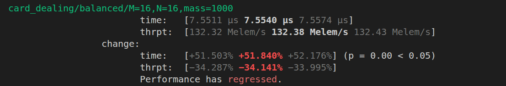

## Intro
{/* TODO: explain how I came to this problem */}

## Formulation
{/* TODO: explain the mathematical formulation of the problem */}
### Naming
{/* TODO: Make it more clear that this is a joke / intended to be funny and poke fun at ChatGPT */}
When I asked ChatGPT how different formulations of this problem should be called, it came up with these:
- "nonnegative integer matrices with fixed row and column sums"
- "contingency tables with fixed margins"
- "integer points in a transportation polytope"
- "matrix with prescribed margins"
- "bounded contingency tables"
- "fiber of a contingency table"

While I am going to leave these suggestions here for the entertainment of the reader--and maybe also the benefits of search engine optimization--I have elected to call this problem "Sampling Random Matrices under Fixed-Margins".

## Ideas
- Card Dealing: For each integer value of the fixed matrix mass, assign that mass to a random unfilled bin.
- Noise Scaling: Generate a matrix of noise values, then scale rows and columns of that matrix to match the target margins. Afterwards, clamp to nearest integers and normalize to maintain margin invariants.
- Index Sampling: Create a function mapping between N and all of the possible worlds. Then sample from the space 0..num_worlds and simply apply the function to the sample.
- Mass Mixing: Generate a valid world, and then perform "mass swaps" to traverse over the graph of possible worlds.

### Card Dealing
{/* TODO: explain the idea */}

{/* TODO: Update this link */}
The implementation of the card dealing algorithm looks something like this:

```rust
pub fn card_dealing<const M: usize, const N: usize, const T: usize>(
    row_margins: [usize; M],
    column_margins: [usize; N],
    rng: &mut SmallRng,
) -> [[usize; N]; M] {
    debug_assert!(T == M * N);
    let mass_total: usize = row_margins.iter().sum();
    debug_assert!(column_margins.iter().sum::<usize>() == mass_total);

    let mut output = [[0; N]; M];

    let mut remaining_row_mass = row_margins;
    let mut remaining_col_mass = column_margins;

    let mut active_rows = Vec::with_capacity(M);
    let mut active_cols = Vec::with_capacity(N);

    active_rows.extend((0..M).filter(|&row| remaining_row_mass[row] > 0));
    active_cols.extend((0..N).filter(|&col| remaining_col_mass[col] > 0));

    for _ in 0..mass_total {
        let num_cols = active_cols.len();
        let index = rng.random_range(0..active_rows.len() * num_cols);

        let row_idx = index / num_cols;
        let col_idx = index % num_cols;

        let row = active_rows[row_idx];
        let col = active_cols[col_idx];

        output[row][col] += 1;

        remaining_row_mass[row] -= 1;
        remaining_col_mass[col] -= 1;

        if remaining_row_mass[row] == 0 {
            active_rows.swap_remove(row_idx);
        }

        if remaining_col_mass[col] == 0 {
            active_cols.swap_remove(col_idx);
        }
    }

    debug_assert!(output.iter().flatten().sum::<usize>() == mass_total);

    return output;
}
```

When testing the algorithm, I also experimented with avoiding the integer division and modulo by generating two numbers, one for the row, and another for the column.

To absolutely no-ones surprise, generating another random number was slower than my first version of the algorithm. What was interesting, however, was how much slower.

Here is the output for one of the regression tests of the function, which I ran on the alternative implementation (The regression/performance testing for the Monte Cardo project was done with `criterion.rs`).



Across the board, regression tests showed the function to be over 50% slower than the single rng version. While it's nice we can optimize the function so much, the bigger point is this:

Since changing 1 rng call to 2 rng calls increased the runtime by half of the previous runtime, that suggests that around half of the runtime for this algorithm is spent generating random numbers.

If we can find a way to generate less random numbers for each world we sample, we may be able to find a much faster algorithm.

---

The output of this algorithm is not uniformly distributed over the possible worlds.

<details>
<summary>Click me for an explanation.</summary>
Consider the following counterexample
</details>

{/*
Notes: Is this distribution equivalent to the uniform distribution over the possible worlds?

--- Do all this as a collapsable aside ---

Consider the following counterexample
| ? | ? || 2
| ? | ? || 1
|---|---||---
| 1 | 2 || 3

It produces the following two options:

A:
| 0 | 2 |
| 1 | 0 |

and

B:
| 1 | 1 |
| 0 | 1 |

If we are sampling uniformly, then we want P(A) = P(B) = 1/2. So let's figure out what the probability is for each of those options. In the initial state, all four cells are open for assignment.

Choosing the top left corner gives:
| 1 | ? |
| ? | ? |
which forces B

Choosing the top right corner gives:
| ? | 1 |
| ? | ? |
after which all bins are still open. From this position, choosing top left gives B, choosing the top right gives A, choosing the bottom left gives A, and choosing the bottom right gives B.

Choosing the bottom left corner gives:
| ? | ? |
| 1 | ? |
Which forces A

Choosing the bottom right corner gives:
| ? | ? |
| ? | 1 |
Which forces B

So P(A) = 1/4 (0) + 1/4 (1/4 (0) + 1/4 (1) + 1/4 (1) + 1/4 (0)) + 1/4 (1) + 1/4 (0)
= 1/4 (1/2) + 1/4 = 3/8
And P(B) = 1/4 (1) + 1/4 (1/4 (1) + 1/4 (0) + 1/4 (0) + 1/4 (1)) + 1/4 (0) + 1/4 (1) = 5/8

--- End of aside ---

So the distribution is not uniform, but in what way is it biased? It is biased towards states that "capture it". Meaning that it is biased towards states that fill up capacities early. In other words, this method spreads the mass out more than you would get with a uniform distribution.
*/}

### Index Sampling
{/* TODO: explain the idea */}

{/* 
Notes:
First, I needed a way to systematically generate all possible worlds from a given set of margins.
After playing around with a pen and paper, I realized that somtimes all solutions to a particular row or column would result in valid world solutions. In particular, this was true when I chose the most constrained row or column to solve.
EXPLAIN WHY THIS IS THE CASE
Using this, I quickly wrote up some python code and found that for small matrices (3x3, 4x4) it was actually fairly simple to enumerate all of the possiblities.
SHOW SOME EXAMPLES, SOLUTIONS, and COUNTS
However, then I tried input margins that were more... realistic. I tried sampling for a test scenario of SCUM (full deck of cards), and even counting all of the options quickly became impossible.
SHOW THE SCREENSHOT, TELL HOW BIG THE SPACE IS
The other problem is that despite having this nice algorithm, I still didn't have any way to do my index sampling. If different choices for each stars and bars subproblem (make sure this is explained) lead to different numbers of final possible states, then this approach doesn't actually help me create a generating function.
*/}

### Progressive Stars-and-Bars
{/*
But I did have an idea: a question. I am assuming that the outputs of each of these branches are not balanced, but how unbalanced are they? What if I use my generating algorithm to create a sampling algorithm, by changing each of my row/column enumeration steps into sampling steps.
The basic algorithm would work like this:
EXPLAIN THE ALGORITHM
*/}

{/*
Example of unbalanced branches for the progressive stars-and-bars algorithm

| 0 | 0 | 3 || 3
| 0 | 0 | 0 || 4
| 0 | 0 | 0 || 7
|---|---|---||----
| 4 | 5 | 5 || 14

Since we have already done the first row, the next operation in the algorithm is to assign mass to the right-most column. However, since the second and third rows have such different masses (4 and 7 respectively), assignments/branches that more mass to the second row (and therefore leave more mass to the third) will have many more final states. This is because the number of valid assignments for the stars-and-bars subproblem is not linear with respect to the amount of mass, it grows exponentially (maybe check this and have the right term)
EQUATION FOR THE NUMBER OF OUTPUTS OF STARS AND BARS

But what direction is it biased? The algorithm will be biased towards the low-count branches. In otherwords, we will be biased towards solutions which concentrate mass (explain this)

We assume that as players play the game, they will naturally tend to eliminate entire classes of cards from their hands, so as the trick progresses, the game will bias towards those types of solutions as well.

However, at the start of the trick, this isn't a good representation of the possible worlds.
*/}