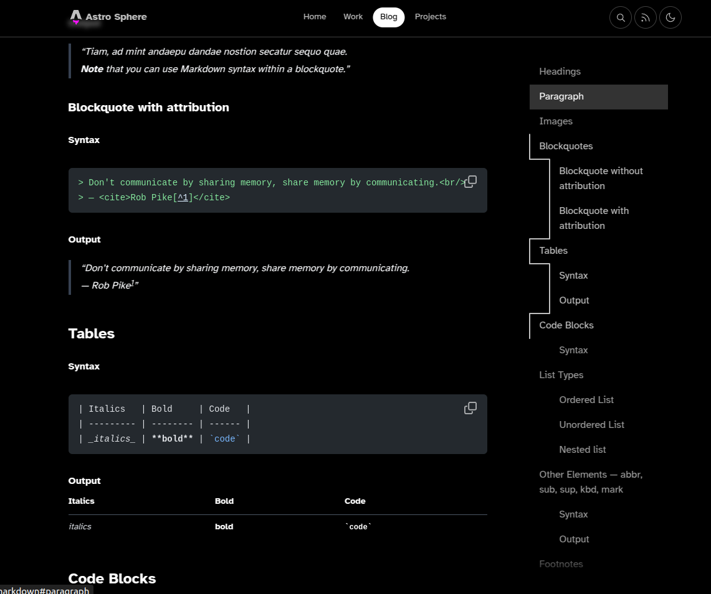
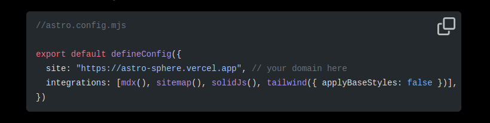
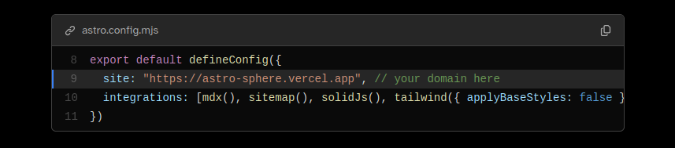

## Overview
Surprise, surprise, I know. Developer made his own website, again.

This website is based on the Astro template [Astro Sphere](https://github.com/markhorn-dev/astro-sphere), by Mark Horn, of which I am a contributor. The template is smooth and sexy, simple but appealing.

*(To see my fork of the template, with all of the features seen on this website, visit [here](https://github.com/HesitantlyHuman/astro-sphere) instead)*

### Why Astro?
If you are a frontend developer, or just someone interested in web development, give [Astro](https://astro.build/) a look. While I am not trying to be yet another framework shill, Astro is truly a great technology.

For my personal website, I needed to serve a static site, since I am hosting on GitHub Pages. Beyond that requirement, however, I also wanted the experience of using/navigating my site to be smooth, fast and enjoyable (You be the judge of how I did!).

Astro specializes in server-side rendering of components, which means that what I send to the client is just lightweight HTML, along with some minimal Javascript. For someone who studies compilers and compiler technology, that approach wasn't a hard sell.

## Contributions
So what parts of Astro Sphere are mine?

While a large portion of the styling and base functionality existed before I joined the project, there are three large changes I made to the template.

### Article Table of Contents
By far my favorite addition to Astro Sphere is the Table of Contents component that you can find on the full-width versions of blog and project posts (Desktop visitors may be able to see it off to the right, there). The component is both functional--improving the usability of the page--and aesthetic. There is a certain level of polish brought by a good navigation element.

Here is an example of the TOC in action, as demonstrated by one of Astro Sphere's example articles.



The TOC is dynamically generated from the headings in the reference `.mdx` or `.md` file, and each button automatically linked to the relevant header. All sections currently in view are highlighted, and the current page scope is represented by the animated white line which hugs the left side of the menu.

Inspiration for the design comes from [Kevin Drum](https://kld.dev/building-table-of-contents/) who created a very similar component for his Astro site. I took a lot of inspiration while building my version, and I added some additional features that Astro Sphere needed. Namely, Astro Sphere needs to support potentially lengthy articles, since it is a template, and so the TOC needs to be able to scroll with the content, if the TOC is longer than the page height. The image above shows the fade-out styling which indicates when this is the case.

### Code Snippets
The next improvement which I made to Astro Sphere was to the code snippets. While Astro Sphere did have existing styling for code snippets, it didn't actually meet my needs for the template.



My upgrade to the code snippet component acheived two things: First, it added the features I needed--linking to code bases, line-numbers, and line highlighting--and it also brought the code snippets more in line with Astro Sphere's existing crisp, minimal style.



The new code block makes copying more clear, and makes it very easy to configure all of the new features. If you provide a Github link, the component even parses out the relevant line numbers for you.

Here is the code that creates that code snippet example, linked to my Astro Sphere fork:

````markdown link=https://github.com/HesitantlyHuman/astro-sphere/blob/a3561d0569ef9497625ac69b721e03dce6759b34/src/content/blog/02-astro-sphere-getting-started/index.mdx?plain=1#L17-L22 caption=content/blog/02-astro-sphere-getting-started/index.mdx
```js link=https://github.com/HesitantlyHuman/astro-sphere/blob/5c8562ed9ec0590395df40bb4c43fc104cf33eaf/astro.config.mjs#L8-L11 {2}
export default defineConfig({
  site: "https://astro-sphere.vercel.app", // your domain here
  integrations: [mdx(), sitemap(), solidJs(), tailwind({ applyBaseStyles: false })],
})
```
````

### Blog and Project Search
The final change that I needed to make was improving the Astro Sphere blog and project main pages.

{/* 
TODO: Open up a branch that doesn not have this improvement to get an image of how it looked before, so that I can hype myself up.
*/}

## Customizations

- Hero and main page
